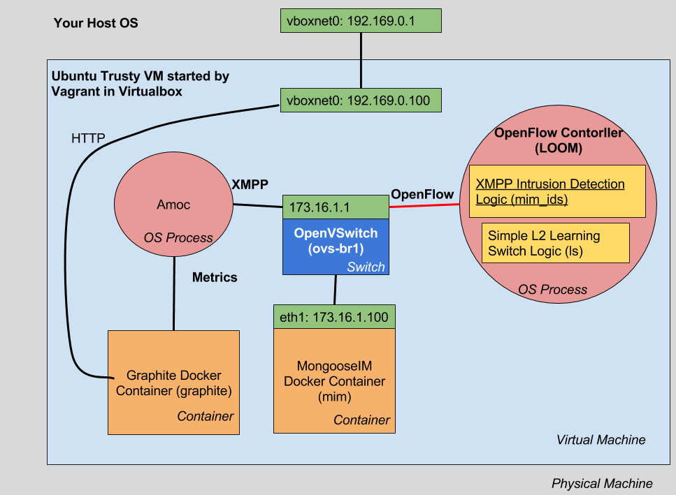
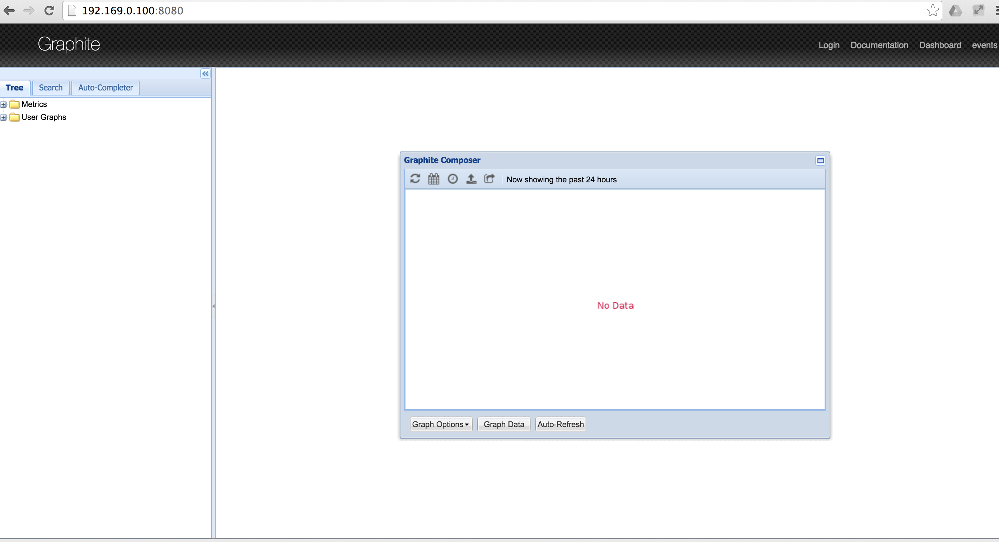
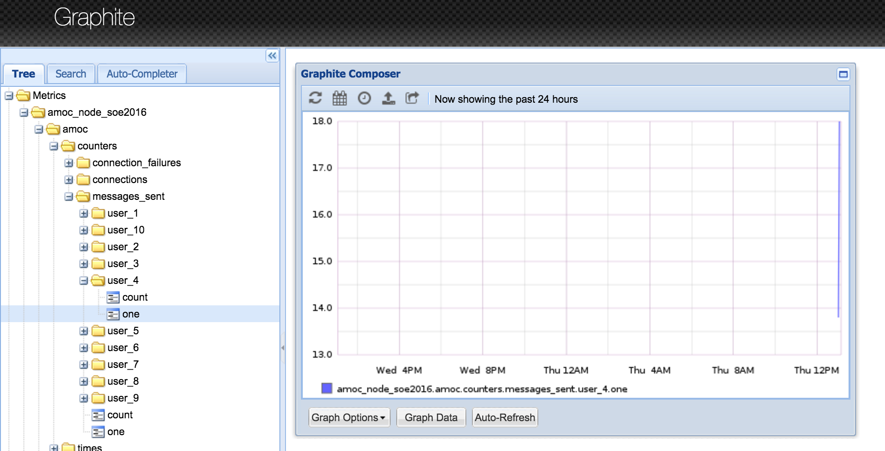
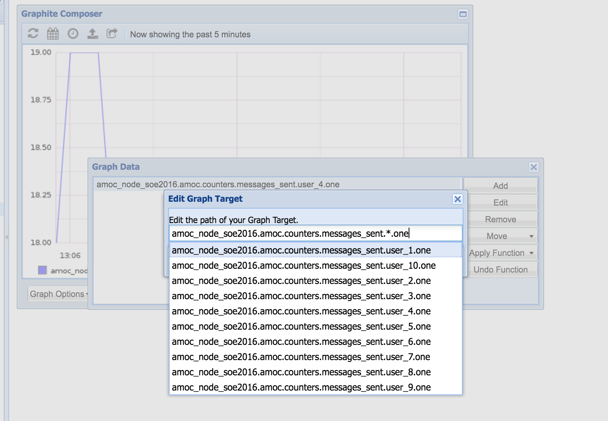
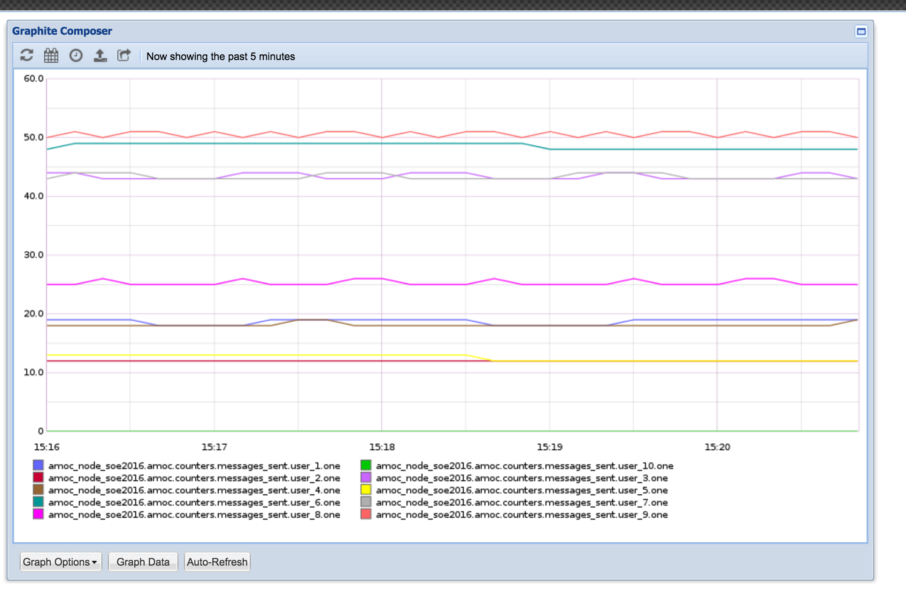

# Environment for XMPP OpenFlow Controller

This is an environment for testing [XMPP Controller](https://github.com/lambdaacademy/2016.04_erlang).

<!-- markdown-toc start - Don't edit this section. Run M-x markdown-toc-generate-toc again -->
**Table of Contents**

- [Environment for XMPP OpenFlow Controller](#environment-for-xmpp-openflow-controller)
    - [Setting up the environment](#setting-up-the-environment)
        - [Environment overview](#environment-overview)
        - [Build and provision the machine](#build-and-provision-the-machine)
        - [Check that things are up and running](#check-that-things-are-up-and-running)
            - [Networking](#networking)
            - [Docker containers](#docker-containers)
            - [MongooseIM](#mongooseim)
            - [Graphite](#graphite)
            - [LOOM OpenFlow Controller](#loom-openflow-controller)
    - [Running a sanity check](#running-a-sanity-check)

<!-- markdown-toc end -->


## Setting up the environment

The environment is based on Vagrant and Virtualbox so you need these two to proceed.

> It was tested on Mac OSX with Vagrant 1.8.1 (`vagrant --version`) and Virtualbox 5.0.10 r104061.

The tools used to build the environment:

1. [Vagrant](https://www.vagrantup.com/)
    - as a tool to setup the environment
2. [Virtualbox](https://www.virtualbox.org/)
    - as backend for Vagrant
4. [Docker](http://docker.io/)
    - to run [container](https://hub.docker.com/r/mongooseim/mongooseim-docker/) with [MongooseIM](https://github.com/esl/MongooseIM)
5. [Amoc](https://hub.docker.com/r/mongooseim/mongooseim-docker/)
    - to run XMPP clients that stress the server
6. [OpenVSwitch](http://openvswitch.org/)
    - to control the traffic hitting the MongooseIM server by using [OpenFlow](https://www.opennetworking.org/sdn-resources/openflow)
5. [ovs-docker tool](https://github.com/openvswitch/ovs/blob/master/utilities/ovs-docker)
    - to setup the networking with the containers
6. [Graphite Container](https://github.com/davidkarlsen/graphite_docker)
    - to visualize some metrics
6. [**LOOM OpenFlow Controller**](http://flowforwarding.github.io/loom/)
    - to implement the Intrusion Detection System in Erlang
    - that will be the base of our project - the rest is to show the real life scenario and to perform some real tests

### Environment overview



### Build and provision the machine ###

Clone this project, enter its directory and run: `vagrant up`. To login into the machine you can use `vagrant ssh`. To suspend it invoke `vagrant suspend` - it can be woken up with `vagrant up`.

### Check that things are up and running


All the commands above are supposed to be run from the VM.

#### Networking

Check that the machine has:
* `eth1` interface with IP address of 192.169.0.100 which is reachable from your host machine (as you should have vboxnet0 interface with IP address 192.169.0.1)
* `ovs-br1` which is the OpenVSwich interface with 173.16.1.1 IP address

Run `ip a` to verify the networking. The output should have the following lines:

```shell
...
3: eth1: <BROADCAST,MULTICAST,UP,LOWER_UP> mtu 1500 qdisc pfifo_fast state UP group default qlen 1000
    link/ether 08:00:27:0a:95:b7 brd ff:ff:ff:ff:ff:ff
    inet 192.169.0.100/24 brd 192.169.0.255 scope global eth1
       valid_lft forever preferred_lft forever
    inet6 fe80::a00:27ff:fe0a:95b7/64 scope link
       valid_lft forever preferred_lft forever
...
6: ovs-br1: <BROADCAST,UP,LOWER_UP> mtu 1500 qdisc noqueue state UNKNOWN group default
    link/ether 56:bf:2e:25:53:49 brd ff:ff:ff:ff:ff:ff
    inet 173.16.1.1/24 brd 173.16.1.255 scope global ovs-br1
       valid_lft forever preferred_lft forever
   inet6 fe80::74a6:1cff:fe0d:d989/64 scope link
       valid_lft forever preferred_lft forever
...
```

#### OpenVSwitch

Check the switch configuration using the [ovs-vsctl](http://openvswitch.org/support/dist-docs/ovs-vsctl.8.txt) command:

```bash
vagrant@soe2016:~$ sudo ovs-vsctl show
c7c4ac72-8a43-4f39-a517-07edcd3ef68c
    Bridge "ovs-br1"
        Controller "tcp:127.0.0.1:6653"
            is_connected: true
        Port "1566fbdcf7ce4_l"
            Interface "1566fbdcf7ce4_l"
        Port "ovs-br1"
            Interface "ovs-br1"
                type: internal
    ovs_version: "2.0.2"

```

You should see that it is set to connect with a `controller` running on local host (127.0.0.1) and port 6653. This indicates that the switch has the OpenFlow enabled. However, if the switch fail to connect with the controller and falls back do regular MAC-learning switch and just work. Once it connects to the controller, it starts relying on it and the controller becomes responsible for setting appropriate forwarding table.

> Look at the `Controller Failure Setting` paragraph in the ovs-vsctl documentation for more information.

To query the switch for the current OpenFlow configuration you can use [ovs-ofctl](http://openvswitch.org/support/dist-docs/ovs-ofctl.8.txt):

```bash
vagrant@soe2016:~$ sudo ovs-ofctl show -O OpenFlow13 ovs-br1
OFPT_FEATURES_REPLY (OF1.3) (xid=0x2): dpid:000056bf2e255349
n_tables:254, n_buffers:256
capabilities: FLOW_STATS TABLE_STATS PORT_STATS QUEUE_STATS
OFPT_GET_CONFIG_REPLY (OF1.3) (xid=0x4): frags=normal miss_send_len=0
```

To understand that configuration, have a look at the [OpenFlow Specification 1.3.2](https://www.opennetworking.org/images/stories/downloads/sdn-resources/onf-specifications/openflow/openflow-spec-v1.3.0.pdf).

To make sure, that the OpenFlow forwarding table is empty, you can run the following command:

```bash
vagrant@soe2016:~$ sudo ovs-ofctl dump-flows ovs-br1 --protocols=OpenFlow13
OFPST_FLOW reply (OF1.3) (xid=0x2):
vagrant@soe2016:~$
```

#### Docker containers

 Verify that two docker containers: mim with MongooseIM server and graphite with graphite are running:
`docker ps`. The output should be similar to the following:

```shell
vagrant@soe2016:~$ docker ps
CONTAINER ID        IMAGE                          COMMAND                  CREATED             STATUS              PORTS                                                                                                          NAMES
0ccd727d3743        davidkarlsen/graphite_docker   "/bin/sh -c /usr/bin/"   11 minutes ago      Up 11 minutes       0.0.0.0:2003->2003/tcp, 2004/tcp, 7002/tcp, 8125/udp, 0.0.0.0:3000->3000/tcp, 8126/tcp, 0.0.0.0:8080->80/tcp   graphite
69896a7e9956        mongooseim/mongooseim-docker   "./start.sh"             11 minutes ago      Up 11 minutes       4369/tcp, 5222/tcp, 5269/tcp, 5280/tcp, 9100/tcp                                                               mim
```

#### MongooseIM


Check that the 100 users are registered in the `localhost` domain in the server:
`docker exec mim ./start.sh "registered_users localhost"`

> `docker exec CONTAINER` invokes a command in the given container`

Check that the server actually listens on the XMPP port (5222) and is reachable via 173.16.1.100 address:
`telnet 173.16.1.100 5222`

You should get the connection and after typing something meaningless the server should return an error:
```shell
vagrant@soe2016:~$ telnet 173.16.1.100 5222
Trying 173.16.1.100...
Connected to 173.16.1.100.
Escape character is '^]'.
ala
<?xml version='1.0'?><stream:stream xmlns='jabber:client' xmlns:stream='http://etherx.jabber.org/streams' id='A90649D738C08E69' from='localhost' version='1.0'><stream:error><xml-not-well-formed xmlns='urn:ietf:params:xml:ns:xmpp-streams'/></stream:error></stream:stream>Connection closed by foreign host.
```

#### Graphite

Check that the web interface of Graphite is accessible on your *host machine* via web browser. Point it to 192.169.0.100:8080. You should see a dashboard like the one below:



## Running a sanity check

All the below commands are invoked in the environment VM (the one provisioned with Vagrant).

Attach to the Erlang shell of MongooseIM server and set the most verbose logging level:

```bash
vagrant@soe2016:~$ docker exec -it mim ./start.sh debug

...

Press 'Enter' to continue
...
Erlang/OTP 17 [erts-6.4] [source-2e19e2f] [64-bit] [smp:4:4] [async-threads:10] [hipe] [kernel-poll:false]

Eshell V6.4  (abort with ^G)
(mongooseim@69896a7e9956)1> ejabberd_loglevel:set(5).
[{{lager_file_backend,"ejabberd.log"},ok},
 {lager_console_backend,ok}]
(mongooseim@69896a7e9956)2>
BREAK: (a)bort (c)ontinue (p)roc info (i)nfo (l)oaded
       (v)ersion (k)ill (D)b-tables (d)istribution
^Cvagrant@soe2016:~$
```

> -it options passed to the `docker exec` make it possible to open interactive shell in the container

Exit the Erlang shell by double Ctrl+C. Next open another with MongooseIM logs:

```bash
docker logs -f mim
```

Finally, start generating XMPP messages with Amoc:

```bash
vagrant@soe2016:~/amoc$ cd amoc && ./simple_run.sh 10
Erlang/OTP 18 [erts-7.3] [source-d2a6d81] [64-bit] [smp:4:4] [async-threads:10] [hipe] [kernel-poll:false]

Eshell V7.3  (abort with ^G)
1> 12:48:19.878 [info] Application lager started on node nonode@nohost
Setup running ...
Directories verified. Res = {[ok],[]}
Setup finished processing hooks ...
12:48:19.905 [info] Application setup started on node nonode@nohost
12:48:20.012 [info] Starting reporters with [{reporters,[{exometer_report_graphite,[{prefix,"amoc_node_soe2016"},{host,"127.0.0.1"},{api_key,[]}]}]},{subscribers,[{exometer_report_graphite,[amoc,users],[size],10000,true},{exometer_report_graphite,[erlang,system_info],[port_count,process_count],10000,true},{exometer_report_graphite,[erlang,memory],[total,processes,processes_used,system,binary,ets],10000,true},{select,{[{{[amoc,times,'_'],'_','_'},[],['$_']}],exometer_report_graphite,[mean,min,max,median,95,99,999],10000,true}},{select,{[{{[amoc,counters,'_'],'_','_'},[],['$_']}],exometer_report_graphite,[one,count],10000,true}}]}]
12:48:20.013 [info] Application exometer_core started on node nonode@nohost
12:48:20.017 [info] Exometer Graphite Reporter; Opts: [{prefix,"amoc_node_soe2016"},{host,"127.0.0.1"},{api_key,[]}]
12:48:20.029 [info] Application exometer started on node nonode@nohost
12:48:20.058 [info] Application crypto started on node nonode@nohost
12:48:20.081 [info] Application asn1 started on node nonode@nohost
12:48:20.081 [info] Application public_key started on node nonode@nohost
12:48:20.126 [info] Application ssl started on node nonode@nohost
12:48:20.142 [info] Application lhttpc started on node nonode@nohost
12:48:20.149 [info] Application amoc started on node nonode@nohost
12:48:20.151 [info] init some metrics
12:48:20.152 [info] starting scenario begin_id=1, end_id=20, length=20
12:48:21.027 [info] checker
12:48:21.800 [info] checker
12:48:30.438 [info] Client <<"user_1">> has sent 2 messages so far
12:48:30.438 [info] Client <<"user_2">> has sent 2 messages so far
12:48:30.495 [info] Client <<"user_3">> has sent 2 messages so far
```

The number passed as the second argument to the `./simple_run.sh` indicates the number of simulated XMPP clients. Now, as your clients are sending messages, Graphite will show you how many messages are sent from particular client. Point your browser on to http://192.169.1.100:8080 and enable a plot for `amoc_node_soe2016.amoc.counters.messages_sent.user_4`:



The improve your experience click `Auto-Refresh` button and select a time range to the past 5 minutes. Finally, click Graph Data and edit the filter so that it includes all the users. Click Edit and then type in then change `user_4` to `*`:



The resulting filter is: `amoc_node_soe2016.amoc.counters.messages_sent.*.one`. Apart from that, change timezone - navigate to Graph Options -> X-Axis -> Time zone and enter `Europe/Warsaw`. Should should end up with the following graph showing how many messages was sent by each of the 10 clients started in my example scenario:



> `count` and `one` under each user are so called data points. The first one idicates the total number of messages sent by a client from the beginning, while the latter one refers to a given time span. By default, each value on the graph indicates how many messages were sent by the client in the last 60 seconds, and the values are reported every 5 seconds from Amoc.

Because each of the client sends messages at different rates the lines for particular users differ. Additionally, one of every 10 clients is not sending messages as it is only receiving them.

The graph will be useful when we will be implementing the intrusion detection system that will be cutting off clients violating the allowed messages rate.

One more thing worth checking, is to see open TCP connections held by the XMPP clients simulated in Amoc:
```bash
vagrant@soe2016:~$ netstat -tn | grep 5222
tcp        0      0 173.16.1.1:54824        173.16.1.100:5222       ESTABLISHED
tcp        0      0 173.16.1.1:54935        173.16.1.100:5222       ESTABLISHED
tcp        0      0 173.16.1.1:37586        173.16.1.100:5222       ESTABLISHED
tcp        0      0 173.16.1.1:53802        173.16.1.100:5222       ESTABLISHED
tcp        0      0 173.16.1.1:53616        173.16.1.100:5222       ESTABLISHED
tcp        0      0 173.16.1.1:39622        173.16.1.100:5222       ESTABLISHED
tcp        0      0 173.16.1.1:46035        173.16.1.100:5222       ESTABLISHED
tcp        0      0 173.16.1.1:58434        173.16.1.100:5222       ESTABLISHED
tcp        0      0 173.16.1.1:33306        173.16.1.100:5222       ESTABLISHED
tcp        0      0 173.16.1.1:36149        173.16.1.100:5222       ESTABLISHED
```
